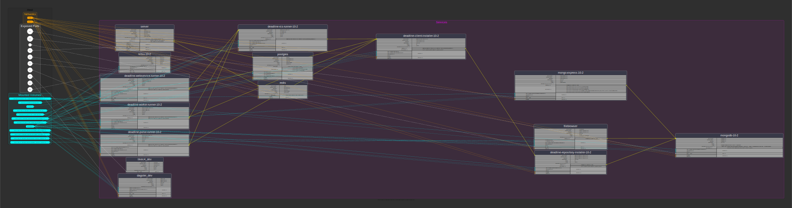

.. These are examples of badges you might want to add to your README:
   please update the URLs accordingly

    .. image:: https://api.cirrus-ci.com/github/<USER>/docker-graph.svg?branch=main
        :alt: Built Status
        :target: https://cirrus-ci.com/github/<USER>/docker-graph
    .. image:: https://readthedocs.org/projects/docker-graph/badge/?version=latest
        :alt: ReadTheDocs
        :target: https://docker-graph.readthedocs.io/en/stable/
    .. image:: https://img.shields.io/coveralls/github/<USER>/docker-graph/main.svg
        :alt: Coveralls
        :target: https://coveralls.io/r/<USER>/docker-graph
    .. image:: https://img.shields.io/pypi/v/docker-graph.svg
        :alt: PyPI-Server
        :target: https://pypi.org/project/docker-graph/
    .. image:: https://img.shields.io/conda/vn/conda-forge/docker-graph.svg
        :alt: Conda-Forge
        :target: https://anaconda.org/conda-forge/docker-graph
    .. image:: https://pepy.tech/badge/docker-graph/month
        :alt: Monthly Downloads
        :target: https://pepy.tech/project/docker-graph
    .. image:: https://img.shields.io/twitter/url/http/shields.io.svg?style=social&label=Twitter
        :alt: Twitter
        :target: https://twitter.com/docker-graph

.. image:: https://img.shields.io/badge/-PyScaffold-005CA0?logo=pyscaffold
    :alt: Project generated with PyScaffold
    :target: https://pyscaffold.org/

|

====================
docker-compose-graph
====================

    Add a short description here!

A longer description of your project goes here...

1. graph_primary yaml
2. graph_includes
3. graph_overrides
4. overlay graph_includes with graph_overrides

API::

    from docker_compose_graph.docker_compose_graph import DockerComposeGraph

    dcg = DockerComposeGraph()
    trees = dcg.parse_docker_compose(
        pathlib.Path("~/git/repos/docker-graph/tests/fixtures/deadline-docker/10.2/docker-compose.yaml")
    )

    # resolve environment variables (optional)
    dcg.load_dotenv(pathlib.Path("/home/michael/git/repos/docker-graph/tests/fixtures/deadline-docker/10.2/.env"))

    # dcg.expand_vars(tree)

    # with open("tree.json", "w") as fw:
    #     json.dump(tree, fw, indent=2)

    dcg.iterate_trees(trees)
    # dcg.connect()
    dcg.write_png()
    dcg.write_dot()

CLI::

   $ docker-compose-graph --help
   usage: docker-compose-graph [-h] [--version] [-v] [-vv] [--no-expand-vars] [--no-resolve-relative-volumes] --yaml DOCKER_COMPOSE_YAML --dot-env DOT_ENV --outfile OUTFILE --format {dot,svg,png}

   Create a graph representation of a Docker Compose file

   options:
     -h, --help            show this help message and exit
     --version             show program's version number and exit
     -v, --verbose         set loglevel to INFO
     -vv, --very-verbose   set loglevel to DEBUG
     --no-expand-vars, -nx
                           Don't expand environment variables
     --no-resolve-relative-volumes, -nr
                           Don't resolve relative volume paths to absolute paths
     --yaml DOCKER_COMPOSE_YAML, -y DOCKER_COMPOSE_YAML
                           Full path to docker-compose.yaml
     --dot-env DOT_ENV, -d DOT_ENV
                           Full path to .env file
     --outfile OUTFILE, -o OUTFILE
                           Full output path
     --format {dot,svg,png}, -f {dot,svg,png}
                           Output format

i.e.::

   docker-compose-graph --yaml docker-compose-graph/tests/fixtures/deadline-docker/10.2/docker-compose.yaml -d docker-compose-graph/tests/fixtures/deadline-docker/10.2/.env --outfile /path/to/new/graph.png -f png

.. _pyscaffold-notes:

Making Changes & Contributing
=============================

This project uses `pre-commit`_, please make sure to install it before making any
changes::

    pip install pre-commit
    cd docker-graph
    pre-commit install

It is a good idea to update the hooks to the latest version::

    pre-commit autoupdate

Don't forget to tell your contributors to also install and use pre-commit.

.. _pre-commit: https://pre-commit.com/

Note
====

This project has been set up using PyScaffold 4.6. For details and usage
information on PyScaffold see https://pyscaffold.org/.
